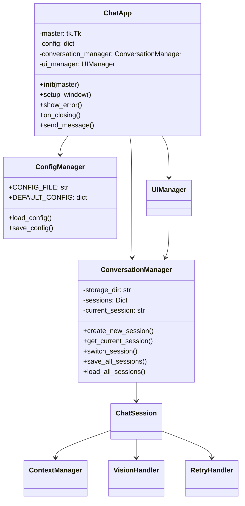

# Claude Chatbot Application

## 프로젝트 개요
이 프로젝트는 Anthropic의 Claude API를 활용한 데스크톱 채팅 애플리케이션입니다. 다중 세션 관리, 컨텍스트 기반 대화, 이미지 처리 기능을 제공합니다.

## 주요 기능
- 🔄 다중 대화 세션 관리
- 💬 컨텍스트 기반 대화 처리
- 🖼️ 이미지 인식 및 처리
- 🎨 다크/라이트 테마 지원
- 💾 대화 내용 자동 저장
- 🔐 암호화된 데이터 저장

## 시스템 요구사항
- Python 3.12.4
- tkinter (GUI)
- Anthropic API 키

## 프로젝트 구조


## 설치 방법
1. 저장소 클론:
```bash
git clone https://github.com/yourusername/claude-chatbot.git
cd claude-chatbot
```

2. 가상환경 생성 및 활성화:
```bash
python -m venv venv
source venv/bin/activate  # Linux/Mac
venv\Scripts\activate     # Windows
```

3. 의존성 설치:
```bash
pip install -r requirements.txt
```

4. 환경 설정:
- `.env.example`을 `.env`로 복사
- Anthropic API 키 설정
- 암호화 키 생성

## 실행 방법
```bash
python main.py
```
또는
```bash
./start.sh  # Linux/Mac
```

## 주요 모듈 설명
- `ChatApp`: 애플리케이션의 메인 클래스
- `UIManager`: GUI 관련 기능 관리
- `ConversationManager`: 대화 세션 관리
- `ChatSession`: 개별 대화 세션 처리
- `ContextManager`: 대화 컨텍스트 관리
- `VisionHandler`: 이미지 처리
- `RetryHandler`: API 재시도 로직

## 현재 진행 상황
- ✅ 기본 채팅 기능 구현
- ✅ 다중 세션 관리
- ✅ 이미지 처리 기능
- ✅ 테마 설정
- ✅ 설정 관리
- 🚧 비동기 처리 개선 필요
- 🚧 UI/ChatApp 순환 참조 해결 필요

## 다음 단계
- [ ] 비동기 처리 일관성 확보
- [ ] 의존성 구조 개선
- [ ] 성능 최적화
- [ ] 테스트 케이스 보강
- [ ] 문서화 강화

## 기여 방법
1. Fork the repository
2. Create your feature branch
3. Commit your changes
4. Push to the branch
5. Create a new Pull Request

## 라이선스
MIT License

## 문의
프로젝트 관련 문의는 이슈 트래커를 이용해 주세요.